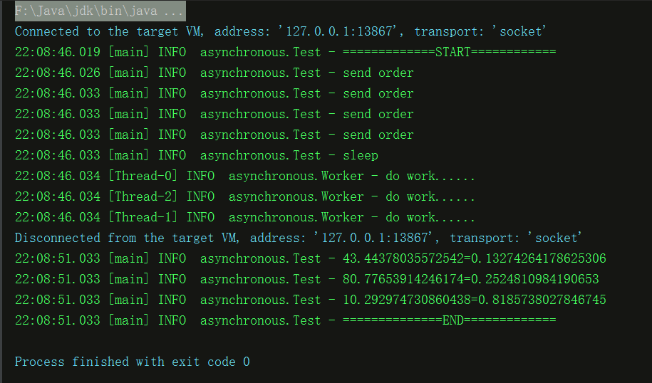

# java 语言深入学习
============================

### JavaReflect
----------------------------
* 学习java的反射机制，使用这种巧妙的方法可以节约很多代码，将自己从编码工作中解放出来
* 手动的编辑，编译，构建，运行项目，充分的学习java的底层运行原理

##### API
```
    Class Class.forName("className")               //加载指定的方法
    Object Class.newInstance()                     //针对此类实例化
    Method Class.getMethod("methodName")           //获取此类的方法
    Method.invoke(objectName,ParamName)            //执行对应对象的方法，传入参数
    Field Class.getField("fieldName")              //获取字段
    Field.setAccessible(true/false)                //设置此属性的权限
    Field.set(objectName,value)                    //设置指定的对象的属性值
    Field.get(objectName)                          //获取指定对象的此属性
    a instanceof A                                 //判断a是否为类A的实例，返回布尔值
```
##### Rember
* 要将你想要获取的属性或者方法设置为public，否则会找不到。
* 指定加载某个类的时候，要加上包名，否则也会找不到。
<br><br><br>

### JavaAnnotation
-------------------------------

在java的很多框架上都是用了注解这一java特性，很明显，这是使用了反射去实现这一技术。

##### the print of the program


### data structure
-------------------------------


### asynchronous
--------------
通过在调用提交任务方法的时候，先返回一个标识，然后开启新的线程执行任务，主线程等待一段时间完毕之后，检查任务完成情况，达到异步效果。
例如，去蛋糕店去顶蛋糕，当你选购完毕，付账之后，会得到一张凭证，此时，蛋糕店厨房会使用新线程去烹饪蛋糕。用户等待一段时间之后，通过凭证领取蛋糕。

